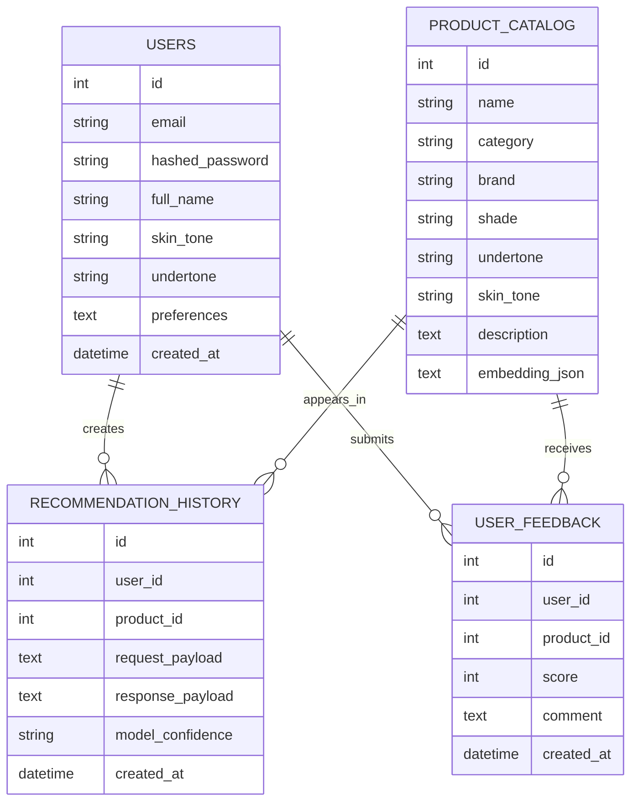

# ER Diagram

```mermaid
erDiagram
    USERS ||--o{ RECOMMENDATION_HISTORY : creates
    USERS ||--o{ USER_FEEDBACK : submits
    PRODUCT_CATALOG ||--o{ RECOMMENDATION_HISTORY : appears_in
    PRODUCT_CATALOG ||--o{ USER_FEEDBACK : receives

    USERS {
        int id
        string email
        string hashed_password
        string full_name
        string skin_tone
        string undertone
        text preferences
        datetime created_at
    }

    PRODUCT_CATALOG {
        int id
        string name
        string category
        string brand
        string shade
        string undertone
        string skin_tone
        text description
        text embedding_json
    }

    RECOMMENDATION_HISTORY {
        int id
        int user_id
        int product_id
        text request_payload
        text response_payload
        string model_confidence
        datetime created_at
    }

    USER_FEEDBACK {
        int id
        int user_id
        int product_id
        int score
        text comment
        datetime created_at
    }
```
