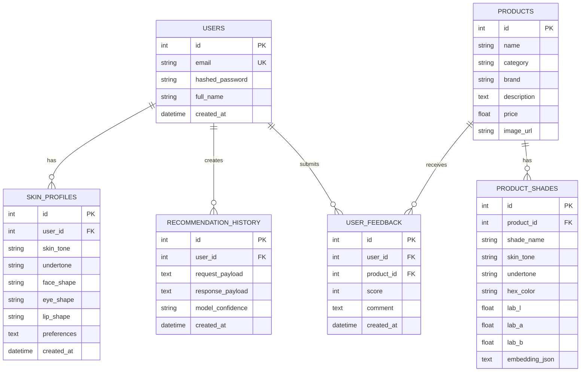

# ER Diagram

```mermaid
erDiagram
    USERS ||--o{ SKIN_PROFILES : has
    USERS ||--o{ RECOMMENDATION_HISTORY : creates
    USERS ||--o{ USER_FEEDBACK : submits
    PRODUCTS ||--o{ PRODUCT_SHADES : has
    PRODUCTS ||--o{ USER_FEEDBACK : receives

    USERS {
        int id PK
        string email UK
        string hashed_password
        string full_name
        datetime created_at
    }

    SKIN_PROFILES {
        int id PK
        int user_id FK
        string skin_tone
        string undertone
        string face_shape
        string eye_shape
        string lip_shape
        text preferences
        datetime created_at
    }

    PRODUCTS {
        int id PK
        string name
        string category
        string brand
        text description
        float price
        string image_url
    }

    PRODUCT_SHADES {
        int id PK
        int product_id FK
        string shade_name
        string skin_tone
        string undertone
        string hex_color
        float lab_l
        float lab_a
        float lab_b
        text embedding_json
    }

    RECOMMENDATION_HISTORY {
        int id PK
        int user_id FK
        text request_payload
        text response_payload
        string model_confidence
        datetime created_at
    }

    USER_FEEDBACK {
        int id PK
        int user_id FK
        int product_id FK
        int score
        text comment
        datetime created_at
    }
```
